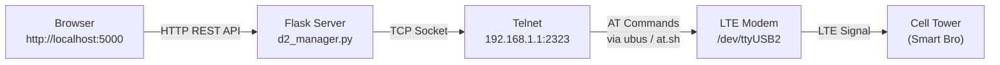
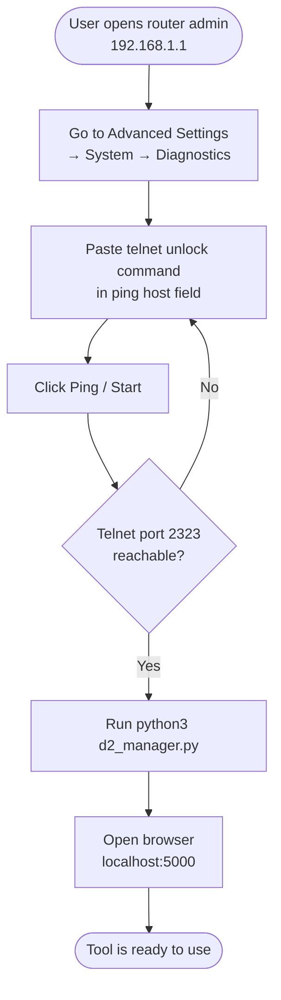
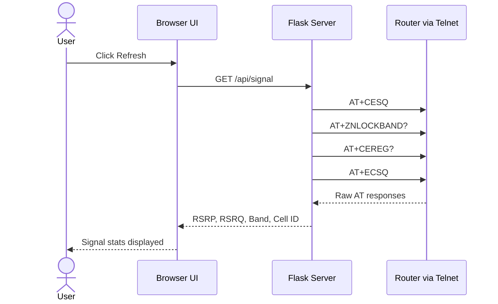
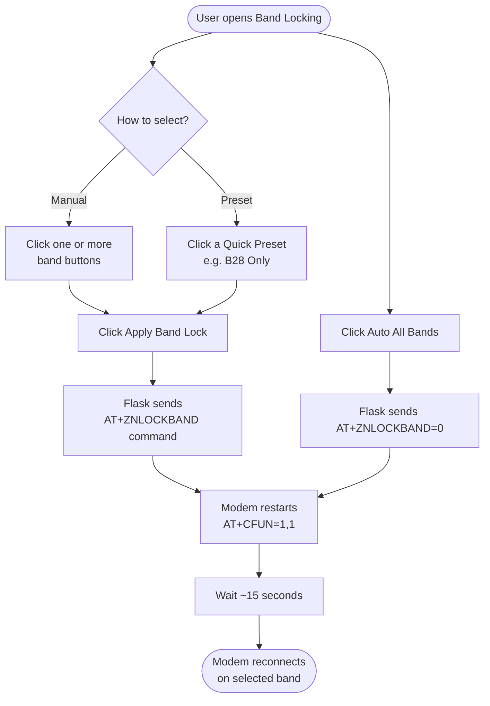
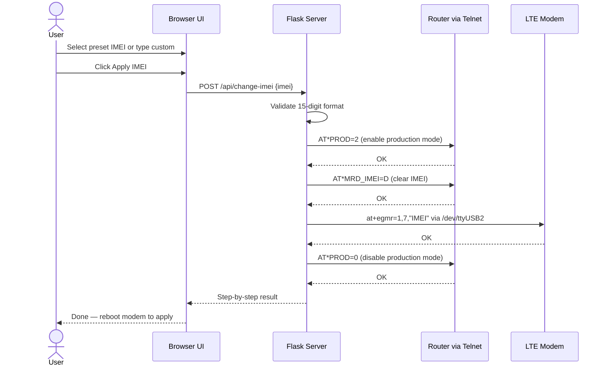
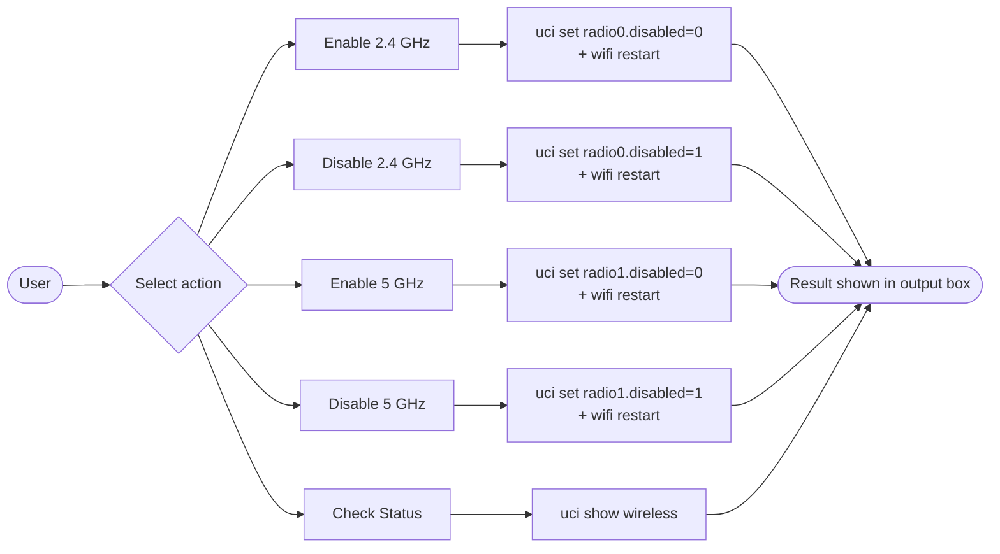

# Smart Bro GreenPacket D2-220G Manager

A local web-based management tool for the **GreenPacket D2-220G** LTE router (used by Smart Bro Home WiFi). Runs entirely on your local network — no data leaves your home.

Built with Python + Flask, accessible via browser at `http://localhost:5000`.

---

## Features

- **Signal Statistics** — Live RSRP, RSRQ, RSSI, SINR, Band, and Cell ID readout
- **LTE Band Locking** — Lock the modem to specific LTE bands (B1, B3, B5, B7, B8, B28, B40, B41)
- **Quick Presets** — One-click band combinations (B28 Only, B1+B3 CA, B1+B3+B28 triple CA, etc.)
- **IMEI Changer** — Change the modem IMEI with preset lists for Globe At Home and SmartBro/PLDT
- **WiFi Band Control** — Enable or disable the 2.4 GHz and 5 GHz radios independently
- **AT / Shell Terminal** — Send raw AT commands or shell commands directly to the router

---

## Installation

### 1. Install Python

Make sure Python 3 is installed on your machine.

- **Windows** — Download from [python.org](https://www.python.org/downloads/). During install, check **"Add Python to PATH"**
- **macOS** — Run `brew install python` (requires Homebrew), or download from python.org
- **Linux** — Usually pre-installed. If not: `sudo apt install python3 python3-pip`

Verify your install:

```bash
python3 --version
```

### 2. Install Flask

```bash
pip install flask
```

Or if `pip` isn't found:

```bash
pip3 install flask
```

### 3. Download the Script

Save `d2_manager.py` to any folder on your computer (e.g. your Desktop).

---

## Running the Tool

```bash
python3 d2_manager.py
```

Then open your browser and go to:

```
http://localhost:5000
```

> Make sure your computer is connected to the D2-220G router's WiFi (or via LAN cable) before running.

---

## One-Time Setup — Enable Telnet Access

Telnet access must be enabled once after every router reboot. It resets when the router is powered off.

1. Open [http://192.168.1.1](http://192.168.1.1) or [http://smartbrosettings.net](http://smartbrosettings.net)
2. Go to **Advanced Settings → System → Diagnostics** (Ping Test)
3. In the **ping host** field, paste exactly:
   ```
   127.0.0.1 & busybox telnetd -p 2323 -l /bin/sh
   ```
4. Click **Ping** or **Start** — the page may show an error, that's normal
5. Open the manager and click **Check Connection**

The tool connects to the router via telnet on port `2323` at `192.168.1.1`.

---

## How It Works — Architecture Overview



---

## User Story Diagrams

### First-Time Setup Flow



### Signal Check



### LTE Band Locking Flow



### IMEI Change Flow



### WiFi Control Flow



---

## How to Use

### 1. Signal Statistics
- Click **Refresh** to pull live signal data from the modem
- Displays RSRP, RSRQ, RSSI, SINR, current Band, and Cell ID
- Raw AT command output is shown below for detailed inspection

### 2. LTE Band Locking
- Click one or more band buttons to select them (they highlight green)
- Click **Apply Band Lock** — the modem will restart and reconnect on the selected band(s)
- Click **Auto (All Bands)** to remove the lock and let the modem pick automatically
- Selecting multiple bands enables **Carrier Aggregation (CA)** for higher speeds

### 3. Quick Presets
- Click any preset card to instantly lock to that band combination
- No need to manually select bands — it applies immediately
- Good starting points: **B28 Only** for best range, **B1+B3 CA** for fastest urban speeds

### 4. IMEI Changer
- **From preset** — click any IMEI from the Globe or Smart list; it fills the input field
- **Custom** — type your own 15-digit IMEI directly into the input field
- Click **Apply IMEI** to run the change sequence
- Reboot the router/modem after applying for the new IMEI to take effect

### 5. WiFi Band Control
- Click **Enable / Disable** under **2.4 GHz Radio** or **5 GHz Radio** to toggle each independently
- Click **Check WiFi Status** to view the current wireless configuration

### 6. AT / Shell Terminal
- Type any AT command (e.g. `AT+ZNLOCKBAND?`) or shell command (e.g. `cat /proc/cpuinfo`) and press **Send** or hit Enter
- Commands starting with `AT` are routed through the modem daemon; all others run as shell
- Use the quick-access buttons for common commands: Current Band Lock, Signal Quality, Registration, etc.

---

## LTE Band Reference

| Band | Frequency     | Notes                        |
|------|---------------|------------------------------|
| B1   | 2100 MHz      | Common urban coverage        |
| B3   | 1800 MHz      | Good speed in dense areas    |
| B5   | 850 MHz       | Better wall penetration      |
| B7   | 2600 MHz      | Fast but short range         |
| B8   | 900 MHz       | Wide coverage                |
| B28  | 700 MHz APT   | Best range and indoor signal |
| B40  | TDD 2300 MHz  | Smart Bro TDD band           |
| B41  | TDD 2500 MHz  | Smart Bro TDD band           |

Multiple bands can be selected at once to enable **Carrier Aggregation (CA)** for faster speeds.

---

## IMEI Changer

Changes the modem IMEI to unlock carrier-specific promos:

- **Globe At Home Prepaid WiFi** — Fam Surf, Home Surf
- **SmartBro Home WiFi / PLDT Prepaid WiFi / Rocket SIM** — Unli Data 599, Unli Fam, Fam Load

You can enter a custom 15-digit IMEI or select from the built-in preset lists. A modem reboot is required after applying.

---

## Default Configuration

| Setting     | Value         |
|-------------|---------------|
| Router IP   | 192.168.1.1   |
| Telnet Port | 2323          |
| Web UI Port | 5000          |
